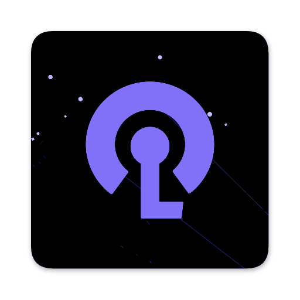
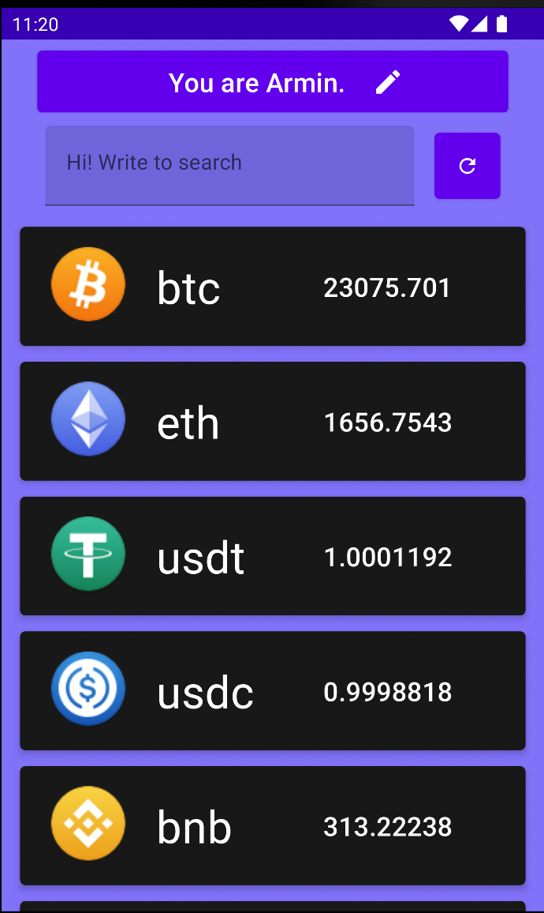
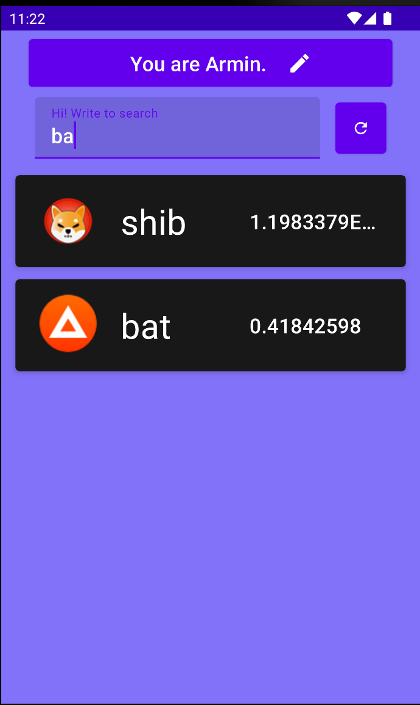
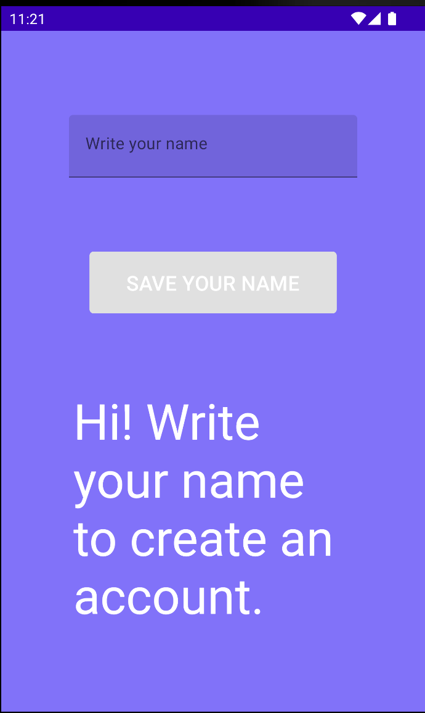
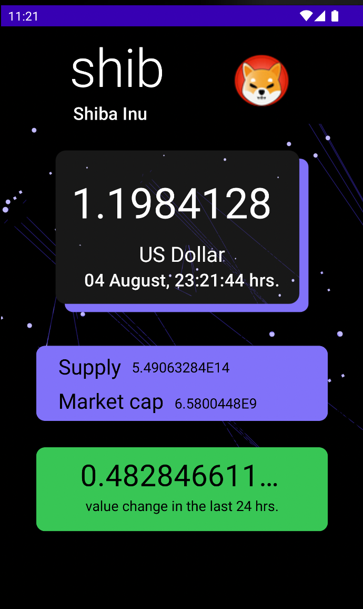
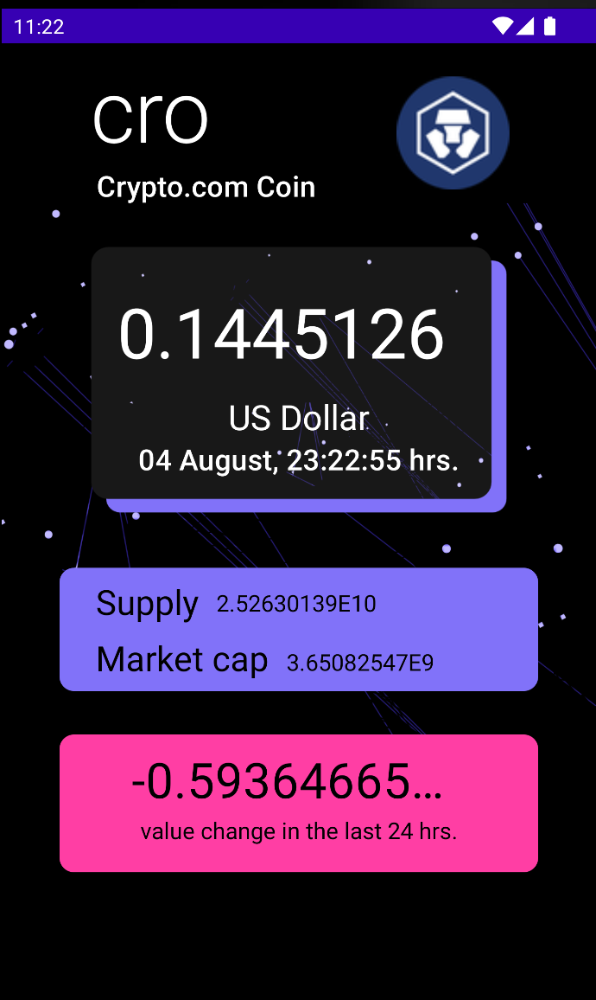

## Qué es CryptoList2
Es una app Android que visualiza una **lista de criptomonedas** donde cada elemento cuenta con imagen, símbolo y valor actual. 🔎 Puedes **buscar** criptomonedas ingresando parte de su nombre. 📈 Al presionar un elemento del listado, cambia de pantalla y visualiza **más datos de la criptomoneda,** como la variación de su valor en las últimas 24 hrs. ✏️ También puedes añadir un **nombre de usuario** en otra pantalla.

### Imágenes del funcionamiento de la app
|
 |
  |
  |
|--|--|--|
|
Ícono de app. |
Pantalla principal.  |
Buscando criptomonedas que contengan el texto ingresado.  |
|
 |
  |
  |
|
Cambiando de usuario luego de presionar el botón con ícono de lápiz en pantalla principal.  |
Pantalla de detalle luego de presionar una criptomoneda de la pantalla de inicio.  |
Pantalla de detalle cuando el valor de cambio de las últimas 24 horas es negativo.  |
### Cápsula del funcionamiento y potenciales clientes de la app

## Características técnicas
- Lenguaje: Kotlin.
- 🖼 Compose toolkit para construir UI nativo.
- Patrón de arquitectura MVVM.
- Consumo de API RESTful con cliente HTTP Retrofit2. https://docs.coincap.io/
- 🚀 Navigation Component para navegar entre pantallas.
- Librería Coil para cargar imágenes.
- 💾 BBDD SQLite con una capa de abstracción Room. Uso de convertidores para Data class personalizado.
- BBDD NoSQL: DataStore. Para guardar preferencias de usuario.
- 👟 Coroutines.
